# Data Flow Diagram — Brick NDT Pipeline

```mermaid
flowchart TB
    subgraph RAW["📁 Raw Audio Data"]
        A1[("data/raw/grade_a/\n15 × .wav")]
        A2[("data/raw/grade_b/\n15 × .wav")]
    end

    subgraph DSP["🎛️  DSP Preprocessing Pipeline"]
        B1["1. Load Audio\nlibrosa.load\nsr=22050, mono"]
        B2["2. Denoise\nnoisereduce\nprop_decrease=0.85"]
        B3["3. Trim Silence\nlibrosa.effects.trim\ntop_db=30"]
        B4["4. Fix Length\nZero-pad / Center-crop\nto 66150 samples (3s)"]
        B5["5. Mel-Spectrogram\nn_mels=128, n_fft=2048\nhop_length=512"]
        B6["6. dB Conversion\nlibrosa.power_to_db"]
        B7["7. Normalize\nMin-max to [0, 1]"]
        B8["8. Add Channel Dim\n→ (128, 130, 1)"]
    end

    subgraph SPLIT["📊 Stratified Split (70/15/15)"]
        C1[("X_train (20)\ny_train (20)")]
        C2[("X_val (5)\ny_val (5)")]
        C3[("X_test (5)\ny_test (5)")]
    end

    subgraph MODEL["🧠 CNN Model"]
        D1["Input (128, 130, 1)"]
        D2["Conv2D 32 (3×3) + BN + MP"]
        D3["Conv2D 64 (3×3) + BN + MP"]
        D4["Conv2D 128 (3×3) + BN"]
        D5["GlobalAveragePooling2D"]
        D6["Dense 128 (ReLU, L2) + Dropout(0.5)"]
        D7["Dense 2 (Softmax)"]
        D8[("Grade A (0)\nGrade B (1)")]
    end

    subgraph EVAL["📈 Evaluation & Visualisation"]
        E1["Confusion Matrix"]
        E2["ROC / PR Curves"]
        E3["Per-Class Metrics\n(precision, recall, F1)"]
        E4["Figures (7 PNGs)"]
    end

    A1 --> B1
    A2 --> B1
    B1 --> B2 --> B3 --> B4 --> B5 --> B6 --> B7 --> B8
    B8 --> SPLIT
    C1 --> D1
    C2 --> D1
    D1 --> D2 --> D3 --> D4 --> D5 --> D6 --> D7 --> D8
    C3 --> EVAL
    D8 --> EVAL
```

---

## Pipeline Summary

| Stage | Input | Output | Key Parameters |
|-------|-------|--------|----------------|
| **Raw Audio** | `.wav` files (15 A, 15 B) | Audio time-series | `sr=22050`, mono |
| **Mel-Spectrogram** | 66150 samples | `(128, 130, 1)` | `n_mels=128`, `hop=512` |
| **Stratified Split** | 30 samples | Train (20), Val (5), Test (5) | 70/15/15 ratio |
| **CNN** | `(128, 130, 1)` | `(2)` Softmax | 110K params, binary |
| **Evaluation** | Test predictions | Metrics + Figures | accuracy, F1, CM, ROC |
